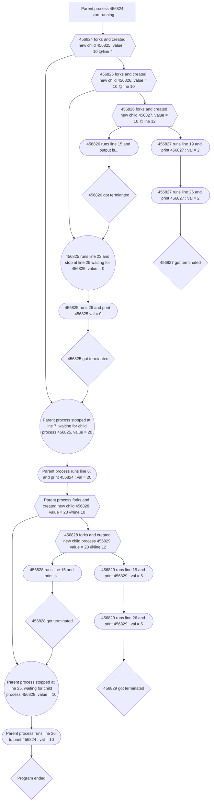

```mermaid
flowchart TD
a[Parent process 456824 start running]
b{{456824 forks and created new child 456825, value = 10 @line 4}}
c((Parent process stopped at line 7, waiting for child process 456825, value = 20))
c1([Parent process runs line 8, and print 456824 : val = 20 ])
c2{{Parent process forks and created new child 456828, value = 20 @line 10}}
x1{{456828 forks and created new child process 456829, value = 20 @line 12}}
y1([456829 runs line 19 and print 456829 : val = 5])
y2([456829 runs line 26 and print 456829 : val = 5])
y3{456829 got terminated}
d{{456825 forks and created new child 456826, value = 10 @line 10}}
e((456825 runs line 23 and stop at line 25 waiting for 456826, value = 0))
f{{456826 forks and created new child 456827, value = 10 @line 12}}
f1([456827 runs line 19 and print 456827 : val = 2])
f2([456827 runs line 26 and print 456827 : val = 2])
f3{456827 got terminated}
g([456826 runs line 15 and output ls...])
g2{456826 got termianted}
i([456825 runs 26 and print 456825 val = 0])
i2{456825 got terminated}
c3((Parent process stopped at line 25, waiting for child process 456828, value = 10))
c4([Parent process runs line 26 to print 456824 : val = 10])
x2([456828 runs line 15 and print ls...])
x3{456828 got terminated}
z{Program ended}

a --> b
b --> c
b --> d
d --> e
d --> f
f --> g
g --> g2
g2 --> e
e --> i
i --> i2
f --> f1
f1 --> f2
f2 --> f3
i2 --> c
c --> c1
c1 --> c2
c2 --> c3
c2 --> x1
x1 --> x2
x2 --> x3
x3 --> c3
c3 --> c4
c4 --> z
x1 --> y1
y1 --> y2
y2 --> y3
```