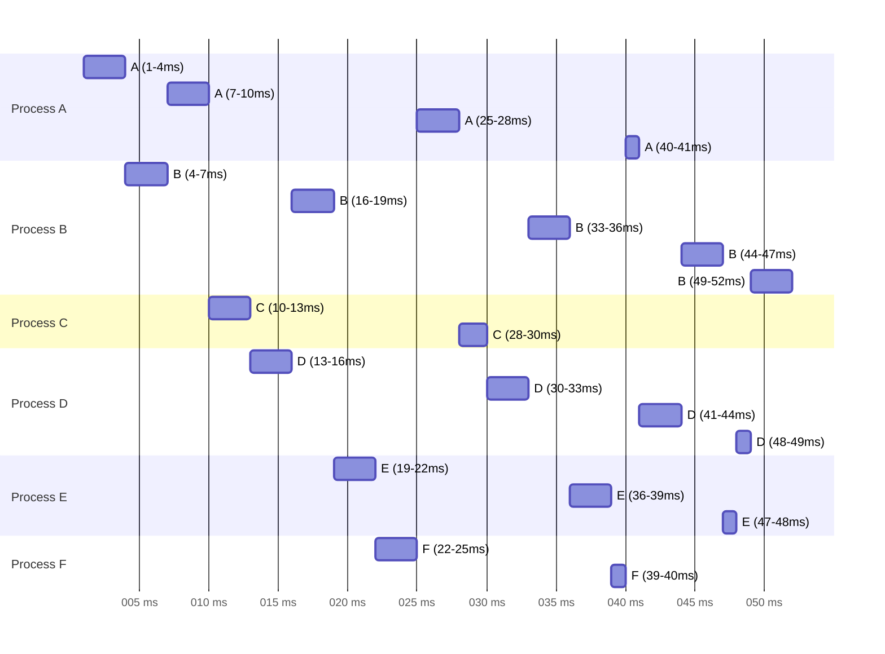

```mermaid
gantt
    dateFormat SSS
    axisFormat %L ms
    
    section Process A
    A (1-4ms) : 001, 3ms
    A (7-10ms) : 007, 3ms
    A (25-28ms) : 025, 3ms
    A (40-41ms) : 040, 1ms
    
    section Process B
    B (4-7ms) : 004, 3ms
    B (16-19ms) : 016, 3ms
    B (33-36ms) : 033, 3ms
    B (44-47ms) : 044, 3ms
    B (49-52ms) : 049, 3ms
    
    section Process C
    C (10-13ms) : 010, 3ms
    C (28-30ms) : 028, 2ms
    
    section Process D
    D (13-16ms) : 013, 3ms
    D (30-33ms) : 030, 3ms
    D (41-44ms) : 041, 3ms
    D (48-49ms) : 048, 1ms

    section Process E
    E (19-22ms): 019, 3ms
    E (36-39ms) : 036, 3ms
    E (47-48ms) : 047, 1ms
    
    section Process F
    F (22-25ms) : 022, 3ms
    F (39-40ms) : 039, 1ms
```