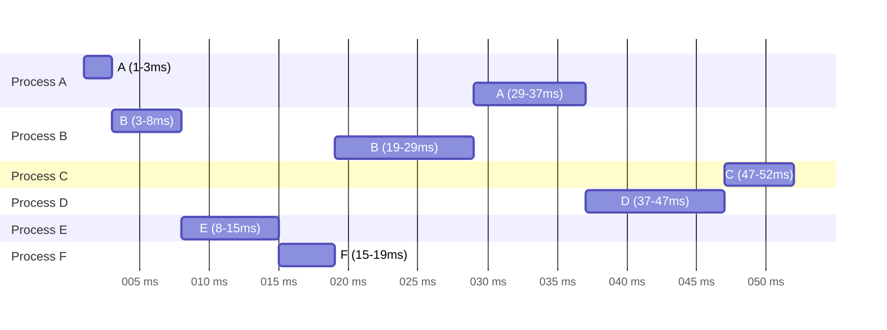

```mermaid
gantt
    dateFormat SSS
    axisFormat %L ms
    
    section Process A
    A (1-3ms)   : 001, 2ms
    A (29-37ms) : 029, 8ms
    
    section Process B
    B (3-8ms)   : 003, 5ms
    B (19-29ms) : 019, 10ms
    
    section Process C
    C (47-52ms) : 047, 5ms

    
    section Process D
    D (37-47ms) : 037, 10ms

    
    section Process E
    E (8-15ms)  : 008, 7ms
    
    section Process F
    F (15-19ms) : 015, 4ms

```