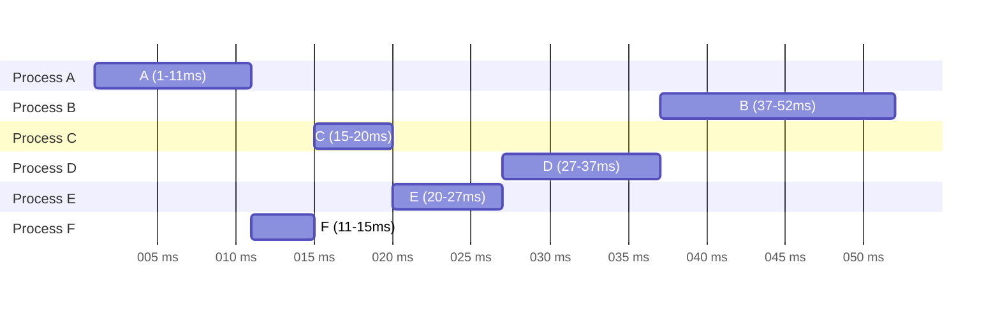

```mermaid
gantt
    dateFormat SSS
    axisFormat %L ms
    
    section Process A
    A (1-11ms)  : 001, 10ms
    
    section Process B
    B (37-52ms) : 037, 15ms
    
    section Process C
    C (15-20ms) : 015, 5ms

    
    section Process D
    D (27-37ms) : 027, 10ms

    
    section Process E
    E (20-27ms) : 020, 7ms
    
    section Process F
    F (11-15ms) : 011, 4ms

```